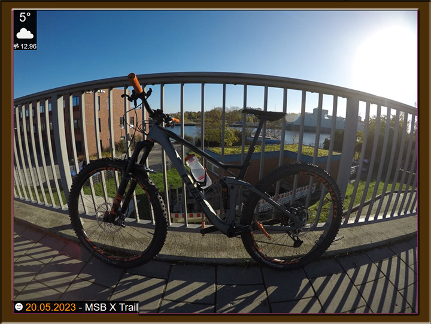

# Pictureframe

Author: Kevin Böckler

Contact: dev@kevinboeckler.de

## Intention

This software is a lightweight web server which acts as a platform for your digital picture frame. That means you can
start the server and navigate in your browser to the served wesbite. It will show you pictures from a Webdav source and
some more "widgets".



## Usage

After configuring and starting the server, simply navigate inside your browser to [http://localhost:8000]().

## Installation

### Get the binary

Download or compile yourself by running

`env GOOS=linux GOARCH=amd64 go build`

replacing the target runtime as you like.

### Install the binary

You can simply extract the bundle _pictureframe.zip_ into an arbitrary folder on your picture frame backend.

The following file structure must be present:

- install_dir
    - `pictureframe` (or `pictureframe.exe`)
    - config.json
    - www/ - directory

### Configuration

Make a copy of _config.json_example_ and name it _config.json_. Put it next to your executable.

A sample configuration file looks as follows:

```json
{
  "server": {
    "ip": "127.0.0.1",
    "port": 8000,
    "hibernateOn": [
      "hibernateOn.sh"
    ],
    "hibernateOff": [
      "hibernateOff.sh"
    ],
    "calendarFaMappings": {
      "Birthday": "fa-cake-candles",
      "Medical": "fa-briefcase-medical"
    }
  },
  "webdav": {
    "root": "https://mynextcloud-server.com/remote.php/dav/files/nextcloud_user/",
    "user": "nextcloud_user",
    "password": "nextcloud_password",
    "folders": [
      "My great pictures",
      "Wallpapers"
    ],
    "excludeFolders": [
      "Wallpapers/Uninteresting"
    ],
    "maxFilesizeMb": 20.0,
    "lightpictureBase": "https://mylightpicture-server.com/lightpicture"
  },
  "caldav": {
    "baseUrl": "https://mynextcloud-server.com",
    "homePath": "/remote.php/dav",
    "user": "nextcloud_user",
    "password": "nextcloud_password"
  },
  "openweather": {
    "lat": 53.8505,
    "lon": 10.6989,
    "appid": "abcdefg123"
  }
}

```

| Field               | Description                                                                                                                                                                                                                                                          |
|---------------------|----------------------------------------------------------------------------------------------------------------------------------------------------------------------------------------------------------------------------------------------------------------------|
| server              | holds the server configuration                                                                                                                                                                                                                                       |
| .ip                 | the ip of _pictureframe_.                                                                                                                                                                                                                                            |
| .port               | the port of _pictureframe_.                                                                                                                                                                                                                                          |
| .hibernateOn        | Array definition of strings denoting many script files which will be executed when _pictureframe_ goes hibernating.                                                                                                                                                  |
| .hibernateOff       | Array definition of strings denoting many script files which will be executed when _pictureframe_ exits hibernating.                                                                                                                                                 |
| .calendarFaMappings | Map structure denoting key value pairs. Each key stands for the exact name of a calendar, each value for the font awesome-icon-class e.g. ```fa-calendar```. This class will be used to render the icon of the calendar event type in the bottom left of the screen. |
|                     |                                                                                                                                                                                                                                                                      |
| webdav              | holds the webdav configuration (image source)                                                                                                                                                                                                                        |
| .root               | the complete path of a webdav instance, for Nextcloud this would be ```https://mynextcloud-server.com/remote.php/dav/files/nextcloud_user/```, where _nextcloud_user_ has to be replaced with the username.                                                          |
| .user               | the username of the webdav user                                                                                                                                                                                                                                      |
| .password           | the password of the webdav user                                                                                                                                                                                                                                      |
| .folders            | Array definition of strings denoting folder names which should be indexed for image slideshow                                                                                                                                                                        |
| .excludeFolders     | Array definition of strings denoting folder names which should be ignored for indexing                                                                                                                                                                               |
| .maxFilesizeMb      | the limit an imagefile can have to be indexed, otherwise it is ignored                                                                                                                                                                                               |
| .lightpictureBase   | the complete path to a [Lightpicture Proxy server](https://github.com/kboeckler/lightpicture). Optional. If not set, each image download request will be made against the webdav instance.                                                                           |
|                     |                                                                                                                                                                                                                                                                      |
| caldav              | holds the caldav configuration (calendar event source)                                                                                                                                                                                                               |
| .baseUrl            | the base url of the caldav instance without the home path (see next entry), for Nextcloud this would be ```https://mynextcloud-server.com```  .                                                                                                                      |
| .homePath           | the relative home path after the base url, which denotes the application or servlet path, which serves caldav, for Nextcloud this would be ```/remote.php/dav```.                                                                                                    |
| .user               | the username of the caldav user                                                                                                                                                                                                                                      |
| .password           | the password of the caldav user                                                                                                                                                                                                                                      |
|                     |                                                                                                                                                                                                                                                                      |
| openweather         | holds the weather configuration (uses [Openweathermap.org](https://openweathermap.org)                                                                                                                                                                               |
| .lat                | the latitude of your location                                                                                                                                                                                                                                        |
| .lon                | the longitude of your location                                                                                                                                                                                                                                       |
| .appid              | the app id of your subscription                                                                                                                                                                                                                                      |

#### Openweathermap.org

To use the weather information, go to [Create New Account](https://home.openweathermap.org/users/sign_up) and create a
free subscription. An E-Mail will be sent to you holding you _appid_.

### Security

As of now _pictureframe_ will only be run on a device within the local network and will not be exposed to the internet (
ingoing). So this software does not expose its webinterface via https.

I recommend creating service users which have only so many priviliges as necessary for your webdav/caldav instance.

### Admin UI and REST interface

A service file could be looking as follows:

The Admin UI is served at [http://localhost:8000/admin.html]() and provides a simple way to set the backend software to
hibernation mode (which does not reindex files or update the current view on the frontend - this saves energy and
bandwith).

You can also use the light REST Api to controlthe hibernation state similar to the Admin UI:

HTTP GET /hibernate

Response 200:

```json
{
  "hibernate": false
}
```

HTTP POST /hibernate

Requestbody

```json
{
  "hibernate": false
}
```

Response 204

### Controlling the backend with hook scripts

There is a possibility to execute multiple script files (such as .sh or .bat files) whenever the _pictureframe_ software
has been toggled from hibernation to awake or vice versa.

Once configured in _config.json_, you can e.g. control your backend to shut off the monitor (useful, when you backend is
really only a picture frame).

In the example config above, we just execute _hibernateOn.bat_ or _hibernateOff.bat_, which can then be scripted as you
wish.

# Contributing

Feel free to make changes or create Feature requests. It is however not my first priority to maintain this project.

# Known Issues

- At the moment most of the _config.json_ has to be filled, so the service isn't very flexible in configuration. I.e.
  you need to set a webdav, caldav and openweather data source to run this program.
